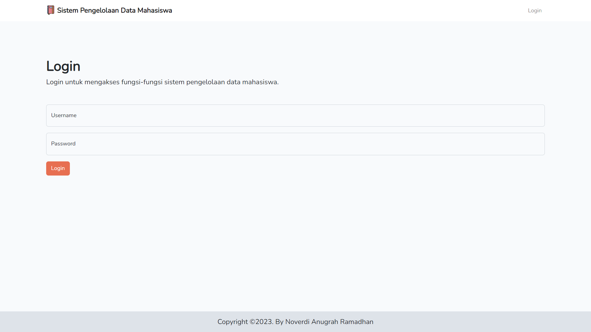
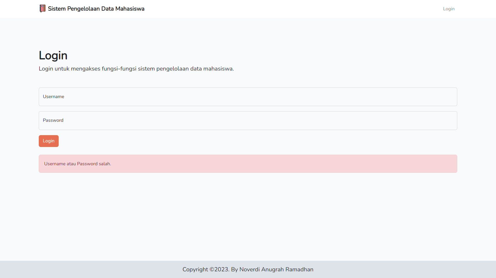
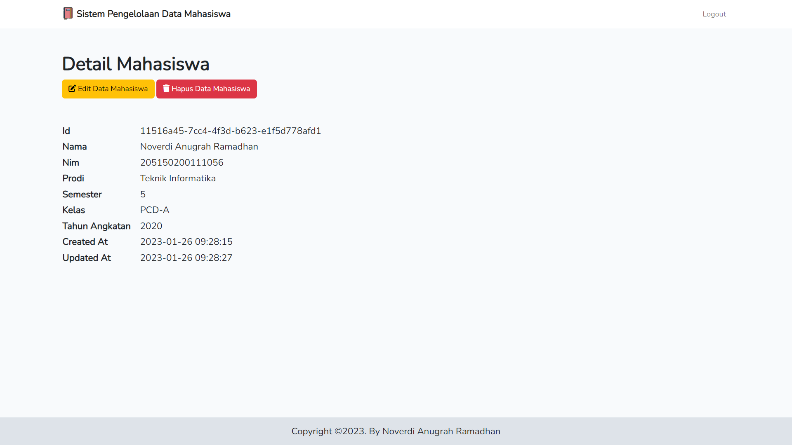
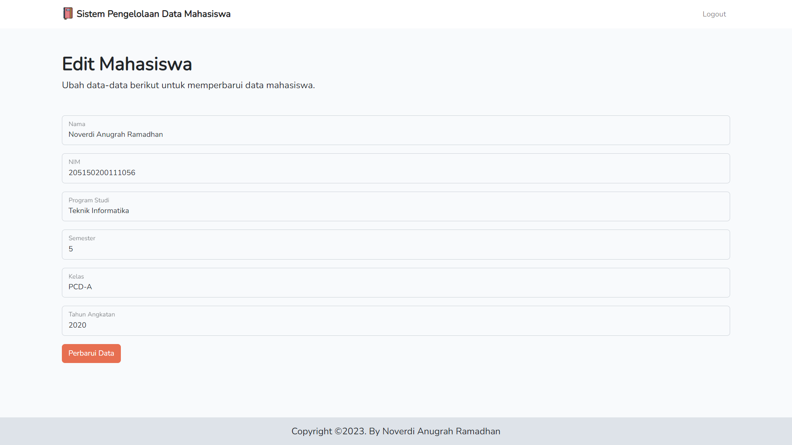
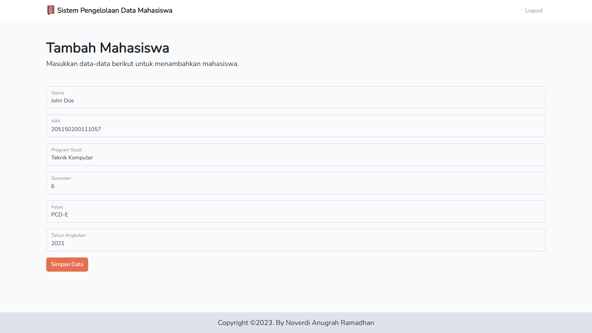
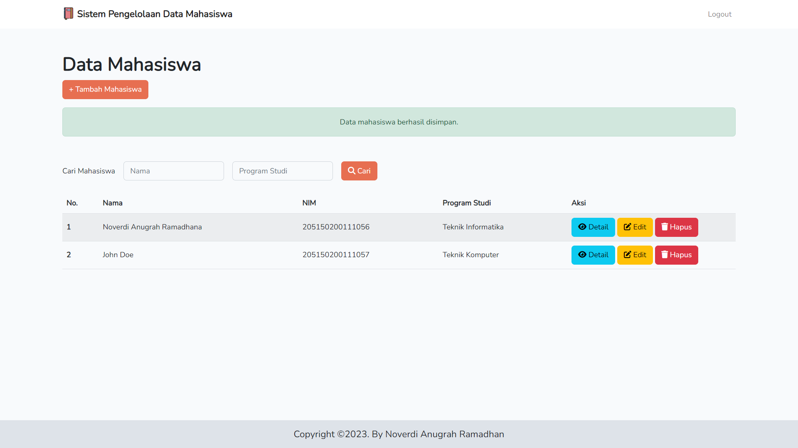
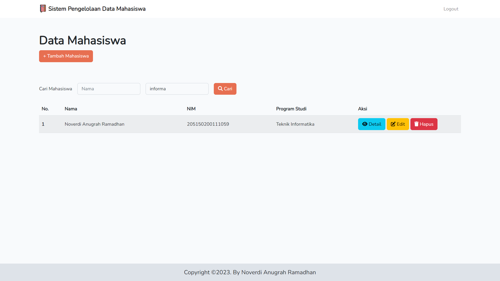
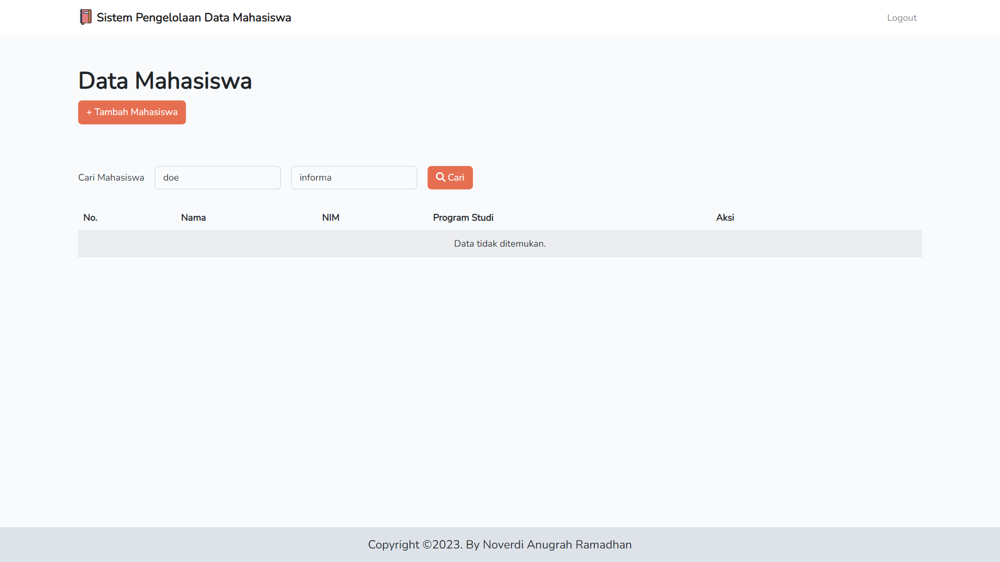
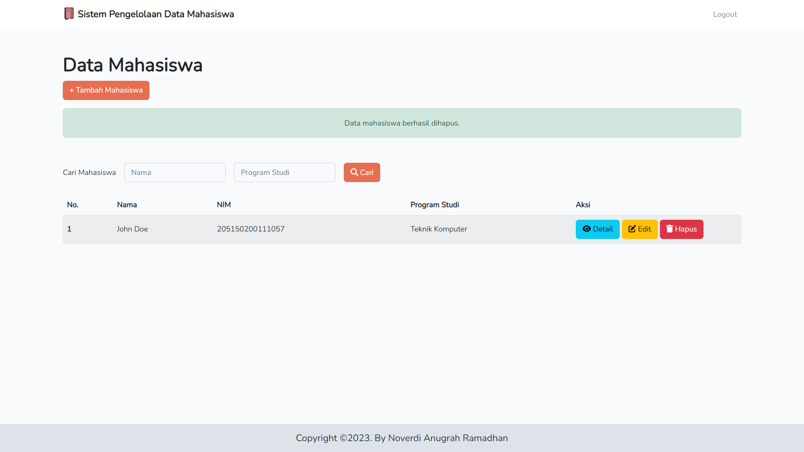
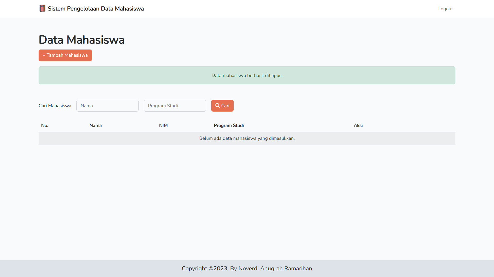

# Seleksi Program Magang Bersertifikat Kampus Merdeka - Yayasan Hasnur Centre - Programmer - YHC

| About Me    |                          |
|-------------|--------------------------|
| Nama        | Noverdi Anugrah Ramadhan |
| Asal Kampus | Universitas Brawijaya    |
| Kota Asal   | Kab. Tanah Bumbu         |

## Prerequisites

1. Apache Web Server
2. MySQL
3. Composer
4. Node Package Manager (NPM)

## How to Run Locally

1. Clone the repository using this command:
    > ```git clone https://github.com/noverdy/seleksi-msib-yhc-quip.git```
2. Copy the environment file from .env.example to .env and customize it according to your setup.
3. Install the dependencies using these commands:
    > ```npm install```
    
    > ```composer install```
4. Migrate the database using this command:
    > ```php artisan migrate```
5. Run this command to start the app:
    > ```npm run dev```

    > ```php artisan serve```
6. Browse to `localhost:8000` in your browser.
7. (OPTIONAL) Run this command to seed the database with fake data.
    > ```php artisan db:seed```


## Screenshot Program
<br>

> Tampilan Login


> Login Dengan Kredensial Yang Salah


> Tampilan Awal


> Tampilan Detail Mahasiswa


> Tampilan Edit Mahasiswa


> Tampilan Setelah Edit


> Tampilan Tambah Mahasiswa


> Tampilan Setelah Tambah


> Pencarian Berdasarkan Nama


> Pencarian Berdasarkan Program Studi


> Pencarian Berdasarkan Nama dan Program Studi


> Hapus Data Mahasiswa


> Hapus Data Mahasiswa Hingga Habis
